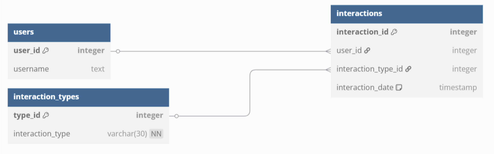

# MusicCircles
Это Telegram-бот, который создает видеосообщения с вашей любимой музыкой.

Бот создан в рамках курсового проекта по конструированию программного обеспечения.

## Музыка🎵 + Обложка🌠 = Кружочек🤩
Этот бот предназначен для создания самых крутых музыкальных видеосообщений, которые выглядят как виниловые пластинки или обложки альбомов 💿.

## Участники проекта
| ФИО                            | Группа        |
|:-------------------------------|:--------------|
| Иглаков Тимофей Юрьевич        | 5130904/20102 |
| Братенков Александр Михайлович | 5130904/20102 |
| Кулагин Илья Александрович     | 5130904/20102 |
| Илюшкин Александр Денисович    | 5130904/20102 |

# Этапы
- [Определение проблемы](#определение-проблемы)
- [Выработка требований](#выработка-требований)
- [Разработка архитеĸтуры и детальное проеĸтирование](#разработка-архитеĸтуры-и-детальное-проеĸтирование)
- [Кодирование и отладĸа](#кодирование-и-отладĸа)
- [Unit тестирование](#unit-тестирование)
- [Интеграционное тестирование](#интеграционное-тестирование)
- [Сборĸа](#сборка)

## Определение проблемы

Пользователи сталкиваются с трудностями при обмене своими любимыми песнями из-за фрагментации музыкальных сервисов (Spotify, Яндекс.Музыка, VK Музыка и др.), где треки доступны только внутри экосистемы конкретной платформы. Это вынуждает отправителя и получателя синхронизироваться в выборе сервиса, что усложняет спонтанное взаимодействие и снижает вовлеченность в совместное прослушивание.

## Выработка требований

Пользовательские истории:

-	Когда я нахожу классную песню, я хочу поделиться ею со своим другом, чтобы он тоже ее услышал.

-	Когда я нахожу картинку альбома подходящей к песне, я хочу отправить картинку и песню вместе, чтобы друг заценил их в совокупности.

-	Когда песня очень длинная, я хочу поделиться только ее фрагментом, чтобы друг мог послушать мою любимую часть.

Оценка числа пользователей сервиса:

-	50к пользователей в сутки.

Оценка периода хранения информации:

-	Храним 10 лет.

## Разработка архитеĸтуры и детальное проеĸтирование

### Характер нагрузки на сервис

Для анализа характера нагрузки будем исходить из одного полного цикла пользователя: **поиск песни -> выбор -> настройка времени -> создание видеокружка**.

- **Поиск песни:** 1+ запросов к audio\_receiver (/search/).
- **Выбор песни:** 1 запрос к audio\_receiver (/track/{id}/info).
- **Создание видео:**
  - 1 запрос на скачивание трека к audio\_receiver (/track/{id}/stream).
  - 1 запрос на скачивание обложки к audio\_receiver (/track/{id}/cover).
  - 1 запрос на обрезку аудио к media\_processor (/trim\_audio).
  - 1 запрос на создание видео к media\_processor (/create\_video).
- **Логирование:**
  - 1+ запросов к database (/log-interaction/) при поиске.
  - 1 запрос к database (/log-interaction/) при создании видео.

#### Соотношение R/W нагрузки

- **Read (Чтение):**
  - audio\_receiver: Все его эндпоинты по своей сути являются Read-операциями (поиск, получение информации/файлов).
  - database: Получение статистики (сейчас не используется ботом, но эндпоинты есть).
- **Write (Запись):**
  - media\_processor: Оба эндпоинта создают новые файлы на диске, что является тяжелой Write-операцией (CPU + Disk I/O).
  - database: Логирование взаимодействия — это легкая Write-операция в БД.
  - telegram\_bot / media\_processor (неявно): Запись временных файлов на диск.

**Вывод:**\
По количеству запросов преобладает нагрузка типа **Read** (пользователь может много раз искать песни, прежде чем создать одно видео). Однако по потреблению ресурсов операция **Write** (создание видео в media\_processor) является на порядки более "дорогой" и длительной.

Примерное соотношение **R/W по количеству запросов ~ 4:1**.\
Примерное соотношение **R/W по потреблению ресурсов ~ 1:20** (один create\_video потребляет гораздо больше ресурсов, чем несколько поисковых запросов).

#### Объемы трафика

Предположим, у нас 1000 активных пользователей в день, каждый из которых создает по 1 видео.

1. **Поиск/инфо (JSON):** Пренебрежимо мало, ~несколько МБ/день.
1. **Обложки:** 200x200 ~ 30-50 КБ. 1000 \* 50 КБ = 50 МБ/день.
1. **Аудио:** Средний трек в MP3 ~ 3-5 МБ. 1000 \* 4 МБ = 4 ГБ/день.
1. **Видео:** Видеокружок длительностью до 60с ~ 5-10 МБ. 1000 \* 8 МБ = 8 ГБ/день.

**Итог:** Основной трафик генерируется при передаче аудио- и видеофайлов между сервисами и пользователю.

- **Внутренний трафик (между сервисами):** ~12 ГБ/день (4 ГБ аудио + 8 ГБ видео).
- **Внешний трафик (от Telegram к боту и от бота к Telegram):** ~8 ГБ/день (видеокружки).

#### Объемы дисковой системы

1. **База данных (SQLite):** Файл database.db. Таблица interactions будет расти. Одна запись ~100 байт. 1000 пользователей \* 2 взаимодействия/день \* 365 дней \* 100 байт = ~73 МБ/год. Объем незначительный.
1. **Временные файлы:** Это самая большая и важная часть. На каждый запрос создания видео telegram\_bot и media\_processor сохраняют на диск:
   1. Полный аудиофайл (~4 МБ).
   1. Обрезанный аудиофайл (~1 МБ).
   1. Обложку (~50 КБ).
   1. Итоговое видео (~8 МБ).\
      Итого ~13 МБ на одного пользователя. Если 100 пользователей одновременно создают видео, потребуется **~1.3 ГБ** временного дискового пространства. Код в telegram\_bot/handlers.py пытается удалять файлы, но при сбоях они могут остаться. Необходимо выделить **минимум 10-20 ГБ** под временные файлы с настроенной системой очистки (например, cron job).

-----

### Диаграммы C4 Model

Уровень 1: System Context Diagram

Эта диаграмма показывает, как система вписывается в окружающий мир.

|**Элемент**|**Описание**|
| - | - |
|**Пользователь Telegram**|Человек, использующий Telegram для взаимодействия с ботом.|
|**Система MusicCircles**|Наш проект. Создает музыкальные видеокружки.|
|**Telegram Bot API**|Внешний сервис, через который Telegram и наш бот обмениваются сообщениями.|
|**Yandex.Music API**|Внешний сервис, источник музыки и метаданных.|

Уровень 2: Container Diagram

Эта диаграмма показывает высокоуровневое устройство системы — её "контейнеры" (сервисы).

|**Контейнер**|**Описание**|**Технология**|
| - | - | - |
|**Telegram Bot**|Принимает команды от пользователя, оркестрирует взаимодействие других сервисов.|Python, python-telegram-bot|
|**Audio Receiver**|API-обертка над Yandex.Music. Ищет, отдает информацию и файлы треков.|Python, FastAPI, yandex-music|
|**Media Processor**|API для тяжелых операций: обрезка аудио, создание видео из аудио и картинки.|Python, FastAPI, ffmpeg, pydub|
|**Database Service**|API для логирования действий пользователя в базу данных.|Python, FastAPI|
|**База данных (SQLite)**|Файловая база данных для хранения логов взаимодействий.|SQLite|

-----

### Контракты API и Нефункциональные Требования (NFR)

audio\_receiver (порт 9000)

- **GET /search/**
  - **Query-params:** query: str, limit: int = 5
  - **Ответ:** 200 OK, 404 Not Found, 500 Internal Server Error
  - **NFR (время отклика):** < 500ms (зависит от API Я.Музыки)
- **GET /track/{track\_id}/info**
  - **Ответ:** 200 OK, 404 Not Found, 500 Internal Server Error
  - **NFR (время отклика):** < 300ms
- **GET /track/{track\_id}/cover**
  - **Ответ:** 200 OK (image/jpeg), 404 Not Found
  - **NFR (время отклика):** < 1s (включая скачивание с Я.Музыки)
- **GET /track/{track\_id}/stream**
  - **Ответ:** 200 OK (audio/mpeg), 404 Not Found
  - **NFR (TTFB - Time To First Byte):** < 2s

media\_processor (порт 8080)

- **POST /trim\_audio**
  - **Form-data:** file: UploadFile, start: int, end: int
  - **Ответ:** 200 OK (audio/mpeg), 400 Bad Request
  - **NFR (время отклика):** < 3s (зависит от размера файла и производительности диска/CPU)
- **POST /create\_video**
  - **Form-data:** audio\_file: UploadFile, image\_file: UploadFile
  - **Ответ:** 200 OK (video/mp4), 400 Bad Request
  - **NFR (время отклика):** **< 20s**. Это самая долгая операция, сильно зависит от CPU.

database (порт 8001)

- **POST /log-interaction/**
  - **Body (JSON):** InteractionCreate model
  - **Ответ:** 200 OK (InteractionResponse), 400 Bad Request
  - **NFR (время отклика):** < 50ms (очень быстрая операция)
- GET /users/{user\_id}, GET /interactions/user/{user\_id}, GET /interactions/
  - **NFR (время отклика):** < 100ms

-----

### Схема Базы Данных

Схема очень простая и нормализованная.



**Почему она выдержит нагрузку:**

1. **Простота и нормализация:** Схема состоит из 3-х маленьких таблиц. Запросы JOIN будут выполняться по целочисленным индексированным полям (user\_id, interaction\_type\_id), что очень быстро.
1. **Низкая интенсивность записи:** Запись происходит всего несколько раз за сессию пользователя. SQLite отлично справляется с такой нагрузкой, так как блокировка всей базы на запись длится миллисекунды.
1. **Индексы:** Первичные ключи (PK) по умолчанию индексируются. Внешние ключи (FK) в SQLite также часто используют индексы для ускорения JOIN. Для текущей нагрузки этого более чем достаточно.
1. **Малый объем данных:** Как посчитано выше, база будет расти очень медленно. Производительность не будет деградировать из-за размера в обозримом будущем.

**Уязвимость:** SQLite не предназначена для высокой конкурентной записи. Если 1000 пользователей одновременно нажмут "Создать видео", все запросы на запись в БД выстроятся в очередь. Для текущего сценария это не проблема, но при росте нагрузки это станет первым узким местом после media\_processor.

-----

### Схема масштабирования при росте нагрузки в 10 раз

При 10-кратном росте (10,000 пользователей/день) текущая архитектура столкнется с проблемами. Вот план масштабирования:

1. **База данных: Замена SQLite на PostgreSQL**
   1. **Проблема:** SQLite не поддерживает конкурентную запись и не может быть развернута как отдельный сетевой сервис.
   1. **Решение:** Переход на **PostgreSQL**. Это полноценная клиент-серверная СУБД, отлично справляющаяся с высокой нагрузкой. Сервис database будет подключаться к ней по сети.
1. **Состояние бота: Вынос сессии в Redis**
   1. **Проблема:** telegram\_bot хранит состояние диалога (user\_data) в памяти. Это не позволяет запустить несколько экземпляров бота для распределения нагрузки.
   1. **Решение:** Вынести хранение сессий в **Redis** (быстрое key-value хранилище в памяти). Каждый экземпляр telegram\_bot будет читать и записывать user\_data в Redis, используя user\_id как ключ. Это сделает сервис telegram\_bot stateless (не хранящим состояние).
1. **Масштабирование сервисов: Горизонтальное масштабирование и Load Balancer**
   1. **Проблема:** Один экземпляр сервиса не справится с 10x нагрузкой.
   1. **Решение:** Запустить несколько экземпляров каждого сервиса (telegram\_bot, audio\_receiver, media\_processor) и поставить перед ними **Load Balancer** (например, Nginx), который будет распределять запросы между ними.
1. **Обработка видео: Асинхронная обработка через очередь задач**
   1. **Проблема:** media\_processor выполняет долгую синхронную операцию. Это блокирует бота и может привести к таймаутам.
   1. **Решение:** Использовать **очередь задач** (например, **RabbitMQ** или **Celery** + Redis).
      1. telegram\_bot вместо прямого вызова media\_processor кладет задачу "создать видео" в очередь и сразу отвечает пользователю: "Ваш кружок создается, я пришлю его, как только он будет готов".
      1. Группа media\_processor **workers** (воркеров) слушает эту очередь, забирает задачи и выполняет их.
      1. По завершении воркер может уведомить бота о готовности (например, через другую очередь или webhook), и бот отправит готовое видео пользователю.
1. **Хранение файлов: Централизованное объектное хранилище**
   1. **Проблема:** Временные файлы хранятся на локальном диске каждого сервиса. При наличии нескольких экземпляров сервисов они не смогут обмениваться этими файлами.
   1. **Решение:** Использовать **Объектное хранилище** (S3-совместимое, например, MinIO или Yandex Object Storage). Все сервисы будут загружать и скачивать временные и конечные файлы из этого центрального хранилища.

Эта схема превращает проект в отказоустойчивую, масштабируемую систему, готовую к серьезным нагрузкам.

## Кодирование и отладĸа

Каждым из учатсников были сделаны коммиты.

## Unit тестирование

Проект включает в себя комплексную систему unit-тестирования для всех микросервисов. Тесты написаны с использованием **pytest** и обеспечивают высокое покрытие ключевой функциональности.

### Структура тестов

1. **telegram_bot/tests/unit/** - Unit тесты для телеграм бота
   - `test_bot.py` - Тесты обработчиков команд и callback функций
   - `conftest.py` - Фикстуры и конфигурация тестов

2. **media_processor/tests/unit/** - Unit тесты для медиа-процессора
   - `test_services.py` - Тесты обработки аудио, изображений и создания видео
   - `test_utils.py` - Тесты вспомогательных функций
   - `conftest.py` - Фикстуры для создания тестовых медиа-файлов

### Основные возможности тестирования

**Telegram Bot тесты:**
- Моки для объектов Telegram API (Update, Message, CallbackQuery)
- Тестирование обработчиков команд (/start, поиск музыки)
- Проверка логики conversation flow
- Тестирование обработки callback-данных
- Моки для внешних API (audio_receiver, media_processor)

**Media Processor тесты:**
- Тестирование обрезки аудио с помощью pydub
- Тестирование обработки изображений (кадрирование в квадрат)
- Моки для FFmpeg операций
- Валидация форматов файлов
- Тестирование создания видео из аудио и изображений

### Запуск unit тестов

```bash
# Запуск всех unit тестов
./run.sh test

# Запуск тестов отдельного сервиса
./run.sh mp-test    # Только media_processor
./run.sh tb-test    # Только telegram_bot

# Или напрямую через Docker Compose
docker compose run --rm media_processor pytest tests/unit
docker compose run --rm telegram_bot pytest tests/unit
```

### Конфигурация pytest

Каждый сервис имеет свой `pytest.ini` с настройками:
```ini
[pytest]
asyncio_mode = auto
...
```

## Интеграционное тестирование

Помимо unit тестов, проект включает интеграционные тесты для проверки взаимодействия между компонентами.

### Типы интеграционных тестов

**Полный workflow тестирование:**
- Тест полного цикла создания видео-кружка
- Взаимодействие между telegram_bot и внешними API
- Проверка обработки ошибок на уровне интеграции

**FFmpeg интеграционные тесты:**
- Реальные тесты создания видео с использованием FFmpeg
- Тестирование обработки медиа-файлов без моков
- Валидация выходных MP4 файлов

### Особенности интеграционных тестов

1. **Медленные тесты с FFmpeg** - отмечены специальными маркерами для возможности отдельного запуска
2. **Использование временных файлов** - тесты создают и очищают временные медиа-файлы
3. **Тестирование реальных HTTP-клиентов** - использование httpx.AsyncClient для API тестов

### Пример интеграционного теста

```python
def test_create_video_integration():
    """Интеграционный тест, который реально запускает ffmpeg. 
    Он медленный, но проверяет реальную работу с ffmpeg."""
    audio_file_io = create_dummy_audio(duration_ms=2000, extension="mp3")
    image_file_io = create_dummy_image(width=1280, height=720, extension="png")

    video_bytes = create_video_from_audio_and_cover_files(audio_file_io, image_file_io)
    
    assert video_bytes is not None
    assert len(video_bytes) > 0
    assert b'ftypmp42' in video_bytes[:100] or b'moov' in video_bytes
```

## Сборка

Проект использует Docker-контейнеризацию и автоматизированную сборку через shell-скрипт.

### Архитектура сборки

Система состоит из 4 микросервисов, каждый со своим Dockerfile:

1. **audio_receiver** (порт 9000) - API для поиска и получения аудио
2. **media_processor** (порт 8000) - обработка медиа-файлов и создание видео
3. **database** (порт 8001) - сервис базы данных
4. **telegram_bot** - основной бот, зависит от всех остальных сервисов

### Команды сборки

```bash
# Полная сборка, тестирование и запуск (по умолчанию)
./run.sh

# Только сборка Docker образов
./run.sh build

# Сборка и тестирование без запуска
./run.sh build && ./run.sh test

# Запуск уже собранных сервисов
./run.sh start

# Остановка всех сервисов
./run.sh stop
```

### Процесс сборки

1. **Сборка образов**: `docker compose build` - создает Docker образы для всех сервисов
2. **Тестирование**: Запуск unit тестов в контейнерах
3. **Развертывание**: `docker compose up -d` - запуск всех сервисов в background режиме

### Docker Compose конфигурация

Конфигурацию можно посмотреть в [этом файле](compose.yaml).

### Особенности сборки

- **Автоматические health checks** для критических сервисов
- **Dependency management** - telegram_bot ждет готовности всех API
- **Volume mapping** для персистентного хранения данных
- **Graceful error handling** в скрипте сборки с проверкой статуса команд

### Требования к окружению

- Docker и Docker Compose
- Bash shell для выполнения run.sh
- Достаточно свободного места для FFmpeg операций
- Сетевые порты 8000, 8001, 9000 должны быть свободны

## Развертывание и конфигурация

### Переменные окружения

Для правильной работы системы необходимо настроить следующие переменные окружения в `.env` файлах соответствующих сервисов:

#### Telegram Bot
```bash
TB_TOKEN=your_telegram_bot_token_here
DOWNLOAD_FOLDER=/app/downloads
AUDIO_RECEIVER_API_URL=http://audio_receiver:9000
MEDIA_PROCESSOR_API_URL=http://media_processor:8000
DATABASE_API_URL=http://database:8001
```

#### Audio Receiver
```bash
YANDEX_MUSIC_API_TOKEN=your_yandex_music_token_here
```

### Первоначальная настройка

1. **Получите Telegram Bot Token:**
   - Обратитесь к @BotFather в Telegram
   - Создайте нового бота командой `/newbot`
   - Сохраните полученный токен

2. **Получите Yandex Music API Token:**
   - Зарегистрируйтесь в Yandex Music
   - Получите API токен

3. **Создайте файлы `.env`.**

## Мониторинг и логирование

### Health Checks

Система включает автоматические проверки здоровья сервисов:

- **audio_receiver**: Проверка доступности FastAPI документации `/docs`
- **database**: Проверка специального endpoint `/health`

### Логирование

Каждый сервис ведет собственное логирование:

- **Telegram Bot**: Логи всех взаимодействий пользователей и API вызовов
- **Media Processor**: Логи обработки медиа-файлов и FFmpeg операций
- **Audio Receiver**: Логи запросов к Yandex Music API
- **Database**: Логи SQL операций

### Мониторинг производительности

**Ключевые метрики для мониторинга:**

1. **Время отклика API:**
   - `/search/` < 500ms
   - `/track/{id}/info` < 300ms
   - `/trim_audio` < 3s
   - `/create_video` < 20s

2. **Использование ресурсов:**
   - Дисковое пространство (временные файлы)
   - CPU утилизация (FFmpeg операции)
   - Память (обработка медиа-файлов)

3. **Доступность сервисов:**
   - Health check статусы
   - Время недоступности
   - Ошибки соединений между сервисами

## Обслуживание и администрирование

### Очистка временных файлов

Система автоматически удаляет временные файлы после обработки.

### Обновление сервисов

```bash
# Остановка всех сервисов
./run.sh stop

# Обновление кода
git pull origin main

# Пересборка и запуск
./run.sh build
./run.sh test
./run.sh start
```

## Примеры использования

### Основные сценарии работы с ботом

```
Пользователь: /start
Бот: Привет! Я помогу создать музыкальный видео-кружок...

Пользователь: Hatters
Бот: Выбери одну песню из найденных:
    1) Hatters – 2Hat (3:25)
    2) Hatters – ZAPI 420 (1:59)
    3) Hatters – JR Player (3:32)
    4) Hatters – KLAYM (1:20)
    5) Hatters – Real Gang (2:7)

Пользователь: [выбирает первую]
Бот: Песня сохранена! Выберите опцию:
     🎵 Время: с 0с по 60с
     ▶️ Создать кружок
     🔄 Другая песня

Пользователь: [настраивает время 30-90сек]
Бот: Время установлено: с 30с по 90с

Пользователь: [Создать кружок]
Бот: Создается видео-кружок...
     [отправляет готовое видео]
```